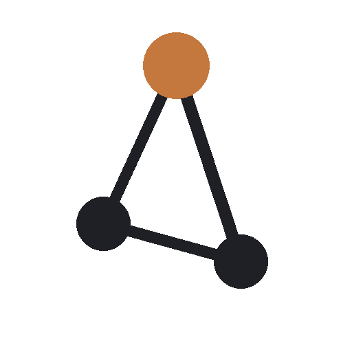

<div align="center">



# CodeAtlas

**A visual map of your development machine.**

[](https://github.com/levimackay/codeatlas/actions/workflows/ci.yml)
[](https://github.com/levimackay/codeatlas/actions/workflows/codeql.yml)
[](#license)

</div>

---

Every developer machine accumulates a mess nobody can fully see: a dozen
half-remembered projects, processes bound to ports you forgot you opened,
Docker images from a tutorial you did in March, three versions of Node,
a `node_modules` folder eating forty gigabytes. CodeAtlas scans your
machine, builds a real model of what's actually there, and shows you the
whole thing: what's installed, what's running, what depends on what,
what's taking up space, and what changed since last time.

It runs entirely on your machine. No account, no cloud sync, no upload,
no telemetry. See `PRIVACY.md` for the specifics.

## What it does

- **Discovers** projects, git repositories, running processes and the
  ports they listen on, Docker containers/images/volumes/networks,
  installed language runtimes, package managers, disk-hungry caches and
  build artifacts, OS services, SSH host configuration, and environment
  variable names (never values).
- **Builds a real dependency graph** from actual evidence — a container
  really was instantiated from that image, a process really is listening
  on that port — not a guess. Every relationship in the graph traces back
  to the discovery provider and evidence that produced it.
- **Tracks change over time.** Every scan is diffed against the last one;
  the timeline shows what got installed, removed, or modified, when.
- **Recommends cleanup, never performs it.** The cleanup center surfaces
  unused Docker images and volumes, stale build artifacts, and caches,
  each with its size, evidence, last-used time, what depends on it, and
  exactly what removing it would do. CodeAtlas does not delete anything
  in the current release; you decide.
- **Searches and navigates fast.** A command palette (`⌘K` / `Ctrl+K`)
  and full-machine search get you to any discovered resource in a couple
  of keystrokes.

It works without an internet connection, an API key, or an account,
and it always will — this is not a thin wrapper around a hosted service.

## Why it exists

I kept losing track of what was actually running on my own machine —
which port 3000 belonged to this week, whether that Postgres container
was still needed, how much of my disk `~/Developer` had quietly eaten.
The tools that exist for parts of this (`docker ps`, `lsof -i`, `du -sh`)
are all fine individually and tell you nothing about how the pieces
relate. CodeAtlas is the tool I wanted: one place that actually
understands the machine as a system, not a pile of unrelated processes.

## Screenshots

*(Screenshots of the actual running application go here once the first
tagged release is cut — see `docs/screenshots/`.)*

## Architecture

Rust backend (a discovery engine, a normalized machine model, SQLite
persistence, a platform abstraction layer for macOS/Linux/Windows) inside
a Tauri 2 shell, with a React/TypeScript frontend. See `ARCHITECTURE.md`
for the full reasoning, including why Tauri over Electron and why Rust
for the discovery engine specifically.

```
crates/core/        domain model: Resource, Graph, ChangeEvent, CleanupCandidate
crates/db/           SQLite persistence, migrations
crates/platform/     platform abstraction traits + per-OS implementations
crates/discovery/     discovery engine + providers (git, docker, runtimes, ...)
crates/cli/          codeatlas CLI binary
src-tauri/            Tauri app shell, IPC commands
src/                  React/TypeScript frontend
website/              marketing site (deployed separately)
```

## Supported platforms

macOS, Linux, and Windows are all targeted by the architecture and CI
builds an installer for each on every tagged release. macOS is the
platform this has actually been run and verified against real system
data on so far; Linux and Windows platform code compiles and is
unit-tested but has not yet had a real-machine run. See `ROADMAP.md`
for the current state of that gap.

## Security and privacy

CodeAtlas treats scanned repositories, container metadata, and process
command lines as untrusted input, never executes anything it discovers,
never reads environment variable values or SSH private keys, and redacts
credentials embedded in git remote URLs before they're ever stored. Full
threat model in `SECURITY.md`; what is and isn't collected in
`PRIVACY.md`.

## Installation

Download the latest installer for your platform from
[Releases](https://github.com/levimackay/codeatlas/releases).

Release builds are currently **unsigned** (no Apple Developer ID or
Windows code-signing certificate configured yet — see `SECURITY.md`),
so macOS will show an "unidentified developer" Gatekeeper warning and
Windows will show a SmartScreen warning on first launch.

## The CLI

CodeAtlas also ships a scriptable CLI, `codeatlas`, built from the same
discovery engine the desktop app uses:

```sh
codeatlas scan                # scan configured (or default) search roots
codeatlas ls project           # list discovered resources by kind
codeatlas search postgres      # search the current machine model
codeatlas changes              # recent timeline entries
codeatlas scans                # scan history
```

## Development

See `CONTRIBUTING.md` for the full setup, but in short:

```sh
git clone https://github.com/levimackay/codeatlas.git
cd codeatlas
pnpm install
pnpm tauri dev
```

```sh
cargo test --workspace   # Rust
pnpm test                 # frontend
```

## Project structure

See the Architecture section above and `ARCHITECTURE.md` for the full
reasoning behind it.

## Contributing

Contributions are welcome. Read `CONTRIBUTING.md` for the development
setup, the rules every discovery provider has to follow (safe process
invocation, no panics on untrusted input, sensitive-data handling), and
the PR process. `CODE_OF_CONDUCT.md` applies everywhere in this project.

## Roadmap

`ROADMAP.md` tracks what's shipped, what's in progress, and what's
planned — including the honest gaps (Windows/Linux not yet run against
real hardware, no environment-snapshot restore yet, unsigned releases).

## License

Dual-licensed under [MIT](LICENSE-MIT) or [Apache License 2.0](LICENSE-APACHE),
at your option. Apache-2.0 adds an explicit patent grant, which matters
for software that inspects a machine's installed toolchains and
containers; MIT satisfies anyone who prefers the simpler, more permissive
option. This is the convention most of the Rust ecosystem uses, which
keeps CodeAtlas's own dependency tree license-compatible without friction.

## Security policy

See `SECURITY.md` for the threat model and how to report a vulnerability
privately.

## Code of conduct

See `CODE_OF_CONDUCT.md`.

## Acknowledgements

Built on [Tauri](https://tauri.app), [rusqlite](https://github.com/rusqlite/rusqlite),
[React](https://react.dev), and the rest of the Rust and npm ecosystems
pinned in `Cargo.lock` and `pnpm-lock.yaml`.
